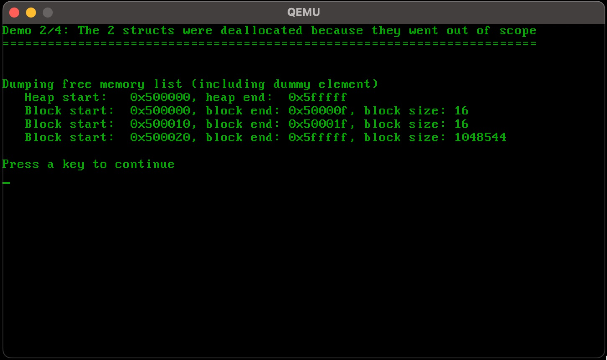
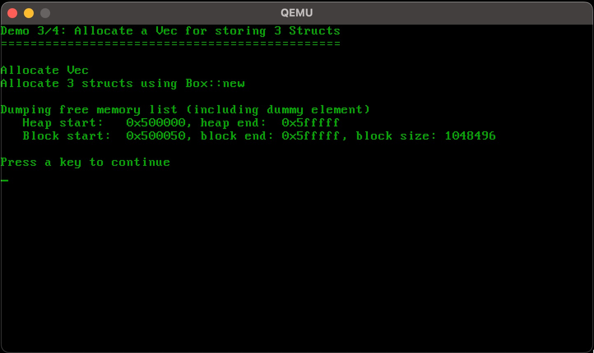
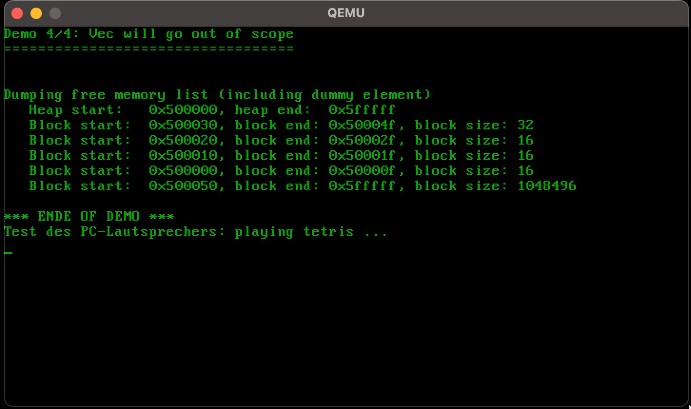

# Aufgabe 2: Speicherverwaltung und PC-Speaker

## Lernziele
1. Verstehen wie eine Speicherverwaltung funktioniert und implementiert wird.
2. Hardwarenahe Programmierung: PC-Speaker / Programmable Interval Timer

Detaillierte Infos zu dieser Aufgabe finden sich [hier](https://os.phil-opp.com/allocator-designs/). Allgemeine Hinweise zu einer Heap-Verwaltung finden sich in `MEM-slides.pdf`.

## A2.1: Bump-Allocator
In dieser Aufgabe soll ein sehr einfacher sogenannter Bump-Allocator implementiert werden, um zunächst die Integration in das System zu verstehen sowie die Anbindung an die Programmiersprache. Dieser Allokator kennt lediglich den Heap-Anfang, das Heap-Ende und merkt sich in der Variablen `next` die aktuelle Adresse im Heap, ab welcher der Speicher frei ist. Bei jeder Allokation wird `next` um die gewünschte Anzahl Bytes weitergesetzt, sofern nicht das Heap-Ende erreicht ist, siehe Abbildung.

Die Heapgröße ist fest auf 1 MB eingestellt, im Speicherbereich 5 – 6 MB - 1. Bei einer Speicherfreigabe passiert nichts. Bauen Sie die Vorgabe in Ihr System ein und stellen Sie sicher, dass der Heap möglichst bald in der Einstiegsfunktion des Betriebssystems initialisiert wird.

Zur Überprüfung der Implementierung sollen einfache Tests geschrieben werden. Weitere Information hierzu finden sich in den nachfolgenden Hinweisen zur jeweiligen Programmiersprache.

In der Datei `bump.rs` soll die Bump-Speicherverwaltung implementiert werden. Die Integration in die Rust-Runtime erfolgt über das `GloballAlloc` trait. Der Speicherallokator wird in
`allocator.rs` in der statischen Variable `ALLOCATOR` angelegt und muss möglichst früh in `startup.rs` initialisiert werden.

Als Tests sollen in `heap_demo.rs` eigene Structs mithilfe von `Box::new` auf dem Heap angelegt
werden. Zu beachten ist, dass es in Rust kein `delete` gibt. 

Sofern die Ownership der Structs nicht weitergegeben wird, so werden die Structs beim Rücksprung aus der Funktion, in der sie angelegt wurden, automatisch freigegeben, indem automatisch `deallocate` im Allokator aufgerufen wird.

Im Gegensatz zu C/C++ muss das Längenfeld eines belegten Blocks bei der Allokation nicht manuell
behandelt werden. Dies erledigt die Rust-Runtime automatisch, jedoch ist der Parameter `layout` in `alloc` und `dealloc` zu beachten.

In folgenden Dateien müssen Quelltexte einfügt werden: `kernel/allocator/bump.rs` und
`user/aufgabe2/heap_demo.rs`.

*Achtung: Die Pointer auf einen neu allozierten Speicherblock müssen aligniert werden. Wie die Alignierung aussehen muss steht im Parameter* `layout` *beim Aufruf von* `alloc`*. In* `allocator.rs` *gibt es hierfür die Hilfsfunktion* `align_up`. 

## A2.2: Listenbasierter Allokator
In dieser Aufgabe soll ein verbesserter Allokator implementiert werden, welcher freigegeben Speicherblöcke wiederverwenden kann. Hierzu sollen alle freien Blöcke miteinander verkettet werden.

Zu Beginn gibt es nur einen großen freien Speicherblock, der den gesamten freien Speicher umfasst. Im Rahmen der Heap-Initialisierung in `LinkedListAllocator::init` soll dieser eine freie Block als erster und einziger Eintrag in der verketteten Freispeicherliste gespeichert werden, siehe Abbildung.


Die globale Variable `ALLOCATOR` (liegt im generierten OS-Image) speichert den Anfang `hs` und das Ende `he` des Heaps sowie einen Dummy `ListNode` mit der Länge 0. Der Dummy dient nur dazu den Einstieg in die Freispeicherliste zu speichern. Nach der Initialisierung liegt im Heap ein `ListNode`, welcher dessen Länge der Heapgröße entspricht, in unserem Fall 5 MB.  


**Allokation**. Bei der Allokation eines Speicherblocks muss die Freispeicherliste nach einem passenden Block durchsucht werden. Es reicht, wenn immer der erste Block genommen wird, der mindestens die Größe der Allokation erfüllt. Sofern der verbleibende Rest groß genug ist, um die Metadaten eines Listeneintrags zu speichern, so soll dieser abgeschnitten und wieder in die Freispeicherliste eingefügt werden.

**Freigabe**. Der freizugebende Block soll in die Freispeicherliste wieder eingehängt werden. Im Prinzip reicht es, wenn er am Anfang der Liste eingefügt wird. Optional kann geprüft werden, ob benachbarte Speicherbereiche auch frei sind und damit verschmolzen werden kann. Dazu muss in der Liste gesucht werden. 

Damit die Freispeicherverwaltung getestet und geprüft werden kann, ist es sinnvoll eine Ausgabe-Funktion zu implementieren, welche die Freispeicherliste komplett auf dem Bildschirm ausgibt. Zudem soll die Test-Anwendung aus Aufgabe 2.1 ausgebaut werden, um auch die Freigabe von Speicherblöcken zu testen.

Das nachstehende Bild zeigt den Heap mit zwei freien und drei belegten Blöcken.

Die folgenden Hinweise sind Ergänzungen zu denen in Aufgabe 2.1!


In der Datei `list.rs` soll die Speicherverwaltung implementiert werden. Der Speicherallokator wird in `allocator.rs` in der statischen Variable `ALLOKATOR` angelegt und muss möglichst früh in
`startup.rs` initialisiert werden.

Verwenden/erweitern Sie die Test aus Aufgabe 2.1. Ein Anregung dazu finden Sie auch in den nachstehenden Abbildungen.

In folgenden Dateien müssen Quelltexte einfügt werden: `kernel/allocator/list.rs` und
`user/aufgabe2/heap_demo.rs`.

*Achtung: Die Pointer auf einen neu allozierten Speicherblock müssen aligniert werden. Wie die Alignierung aussehen muss steht im Parameter* `layout` *beim Aufruf von* `alloc`*. In* `allocator.rs` *gibt es hierfür die Hilfsfunktion* `align_up`. 

## A2.3: PC-Lautsprecher
In dieser Aufgabe muss die Funktion `delay` implementiert werden. Diese Funktion ist für das Abspielen von Tönen notwendig, die eine gegebene Zeitdauer (in ms) gespielt werden sollen. Da wir bisher keine Interrupts verarbeiten können und auch keine Systemzeit haben bietet es sich an den Zähler 0 des Programmable Interval Timer (PIT) hierfür zu verwenden. Dieser muss konfiguriert werden, beispielsweise so, dass der er in 10ms auf 0 herunterzählt. Hierfür soll Mode 2 für den Zähler 0 verwendet werden. Sobald der Zähler die 0 erreicht hat, wird der konfigurierte Zählwert automatisch wieder neu geladen und wieder heruntergezählt. Um größere Zeiten als 10ms zu warten kann in einer Endlosschleife der Zählerstand ausgelesen werden, um damit zu erkennen, ob die 0 erreicht wurde. Für 100ms Verzögerung würde man entsprechend 10 Mal das Herunterzählen auf 0 erfassen. Beim Auslesen des Zählers wird man selten 0 lesen, da ja ständig runtergezählt wird. Man muss also erkennen, ob der Zähler schon wieder heruntergezählt wird und somit die 0 bereits erreicht wurde. 

Dies ist eine unsaubere Lösung die wir später ersetzen werden.

Hinweis: gute Informationen zum PIT 8254 finden Sie in der Datei `8254.pdf` sowie 
[hier](http://wiki.osdev.org/Programmable_Interval_Timer).

In folgenden Dateien müssen Quelltexte einfügt werden: `devices/pcspk.rs` und
`user/aufgabe2/sound_demo.rs`.

## Beispielausgaben zur Speicherverwaltung
Nachstehend sind einige Screenshots zum Testen der Speicherverwaltung. Sie können sich natürlich selbst Testfunktionen und Testausgaben überlegen. Sollten die Ausgaben über mehrere Seiten gehen bietet es sich an auf einen Tastendruck mit `keyboard::key_hit()` zu warten.

