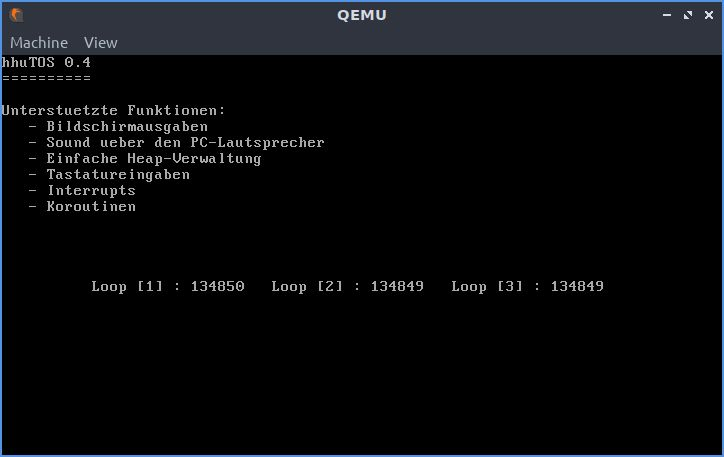
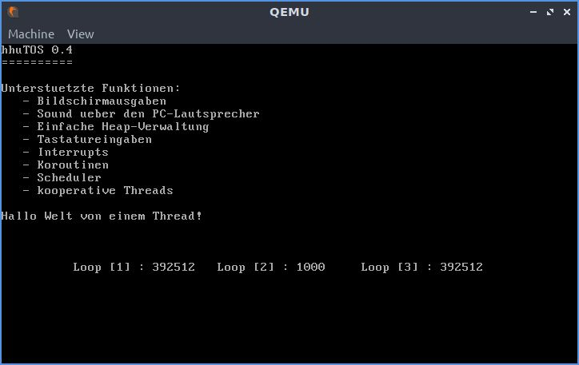

# Aufgabe 4: Koroutinen und Threads

## Lernziele
1. Auffrischen der Assemblerkenntnisse
2. Verständnis der Abläufe bei einem Koroutinen-/Thread-Wechsel
3. Unterschied zwischen Threads und Koroutinen
3. Verstehen wie ein Scheduler funktioniert

Für diese Aufgabe sollte zuvor der Assembler-Crashkurs in `ASM-slides.pdf` gelesen werden sowie die Ergänzung `Coroutine-slides.pdf`.

## A4.1: Koroutinen
In dieser Aufgabe soll die Umschaltung zwischen Koroutinen in Assembler programmiert werden. Koroutinen sind eine Vorstufe zu Threads die später (siehe unten) zusätzlich eingeführt werden. 

Sehen Sie sich zunächst die Inhalte der neuen Dateien in der Vorgabe im Ordner `kernel/corouts` an und implementieren Sie die beiden Assemblerfunktionen `_coroutine_start` und `_coroutine_switch` in `coroutine.asm`. Der Zustand (alle Register) einer Koroutine soll auf dem Stack gesichert werden. Das `rflags`-Register kann nicht direkt per move-Befehl zugegriffen werden, sondern nur mithilfe der Instruktionen `popf` und `pushf`. 

Der Zeiger auf den letzten Stack-Eintrag soll in der Variablen `stack_ptr` in der Struct `Coroutine` gespeichert werden.

Ergänzen Sie anschließend die leeren Funktionen in `coroutine.rs`. Die Verkettung der Koroutinen erfolgt über `next` in der `struct Coroutine`.

### Testprogramm
Schreiben Sie für Ihre Koroutinen-Implementierung folgendes Testprogramm. Im Verzeichnis `user/aufgabe4` der Vorgabe finden Sie hierfür Dateien. Es sollen drei Koroutinen erzeugt und miteinander verkettet werden. Jede Koroutine soll einen Zähler hochzählen und an einer festen Position auf dem Bildschirm ausgeben. Nach jeder Inkrementierung soll auf die nächste Koroutine umgeschaltet werden.  Durch die Verkettung werden die drei Koroutinen dann reihum abwechselnd ausgeführt, wodurch die Zähler scheinbar nebenläufig vorangetrieben werden, siehe nachstehende Abbildung.

In folgenden Dateien muss Code implementiert werden: `kernel/corouts/coroutine.asm`, `kernel/corouts/coroutine.rs`, `user/aufgabe4/corouts_demo.rs` und `startup.rs`.

Hinweis: Schauen Sie sich vor dem Programmieren der Assemblerfunktionen nochmals die Aufrufkonvention für die Parameterübergabe an.

**Beispielausgaben der Koroutinen**

(In eckigen Klammern wird die Koroutinen-ID angezeigt.)

## A4.2: Warteschlange
Der Scheduler benötigt eine Warteschlange (engl. queue) bei der immer am Anfang einer einfach verketteten Liste ein Element entfernt wird (Thread der als nächstes die CPU erhält) und immer Ende eingefügt wird (zum Beispiel ein neuer Thread oder ein Thread der die CPU abgibt).

In Rust ist die Implementierung einer verketteten Liste nicht ganz einfach, weswegen "nur" die Funktion `remove` implementiert werden muss. Es empfiehlt sich die Listenimplementierung zunächst außerhalb von hhuTOSr zu testen.

In folgender Datei muss Code implementiert werden: `mylib/queue.rs`.

## A4.3: Umbau der Koroutinen auf Threads
Kopieren Sie die Datei `kernel/coroutine/coroutine.asm` nach `kernel/threads/thread.asm` um. Passen Sie dann die Namen der Labels in der kopierten Datei an und ersetzen den Namen *coroutine* durch den Namen *thread*.

Danach können Sie die Inhalte von `kernel/coroutine/coroutine.rs` in die Vorgabe `kernel/thread/thread.rs` kopieren. Auch hier soll in `thread.rs` der Namen *Coroutine* durch den Namen *Thread* ersetzt werden. 

Die Variable `next` in `struct Thread` kann entfernt werden. Diese ist überflüssig, da Threads nun in der Queue aus Aufgabe A4.2 im Scheduler verwaltet werden und nicht wie die Koroutinen direkt verkettet sind. Die Funktion `switch2next` soll durch die in der Vorgabe vorgegebene Funktion `switch` ersetzt werden. 

Schliesslich ist in der Vorgabe von `thread.rs` noch eine Implementierung des Traits `PartialEq` für die `struct Thread`. Dies ist notwendig, damit Threads in der Queue verwaltet werden können.

*Hinweis: Diese Aufgabe kann nicht separat getestet werden.*

## A4.4 Scheduler
Nun soll ein einfacher gegebener Scheduler (Round-Robin, ohne Prioritäten) erweitert werden. Alle Threads werden in einer Bereit-Wartschlange (siehe A4.2) verwaltet und bekommen reihum die CPU (nach freiwilliger Abgabe mittels `yield_cpu`). Der aktuell laufende Thread wird in `active` in der struct `Thread` gespeichert. In der Vorgabe ist auch die Implementierung für den Idle-Thread gegeben, welcher läuft, falls kein Anwendungsthread in der Bereit-Warteschlange ist. Der Idle-Thread muss in `startup` mithilfe der Funktion `idle_thread::init()` erzeugt werden, bevor der Scheduler mit `scheduler::Scheduler::schedule()` gestartet wird; dieser Aufruf kehrt nicht zurück.

Testen Sie den Scheduler zunächst nur mit dem Idle-Thread. Bauen Sie hierzu eine Textausgabe in den Idle-Thread ein.

In der gegebenen Datei `scheduler.rs` sind die gekennzeichneten Funktionn zu implementieren. Bei einem Thread-Wechsel soll der Thread am Kopf der `ready_queue` entfernt werden. Gibt der laufende Thread die CPU freiwillig durch Aufruf von `yield_cpu` ab, soll dieser Thread wird wieder am Ende der
`ready_queue` eingefügt werden. 

## A4.5 Multi-threaded Testanwendungen
### HelloWorld-Thread
Die Vorgabe beinhaltet einen fertigen HelloWorld-Thread (`user/aufgabe4/hello_world_thread.rs`), um einen ersten Test durchzuführen. Der Thread gibt einen Spruch aus und terminiert sich dann. Anschließend soll nur noch der Idle-Thread ausgeführt werden. Um dies zu testen soll der Idle-Thread und der HelloWorld-Thread in `main` angelegt und im Scheduler registriert werden. Anschließend soll der Scheduler mit `scheduler::Scheduler::schedule()` gestartet werden.

### Zähler-Threads
Als zweite Testanwendung soll nun das Anwendungsbeispiel für die Koroutinen (A4.1) auf Threads umgebaut werden. 

Ein Haupt-Thread der Anwendung `coop_thread_demo` erzeugt drei Zähler-Threads `coop_thread_loop` und läuft dann ebenfalls in einer Schleife und soll nach jeder Inkrementierung, ebenfalls wie die Zähler-Threads, `yield_cpu` aufrufen. Der Haupt-Thread soll aber keine Ausgabe auf dem Bildschirm machen.

Der Haupt-Thread der Anwendung soll eine gewisse Zeit laufen und sich dann selbst mit `exit` terminieren, nachdem er beispielsweise 1000 Mal die CPU mit `yield_cpu` abgegeben hat. 

Bevor sich der Haupt-Thread der Anwendung terminiert soll er noch einen `coop_thread_loop` mit `kill` terminieren. Somit sollten zunächst drei Zähler auf dem Bildschirm ausgegeben werden und dann einer bei 1000 stoppen, siehe Abbildung unten; hier wurde der Thread mit der ID=2 (in eckigen Klammern) durch den Haupt-Thread terminiert.

**Beispielausgaben der Threads**

