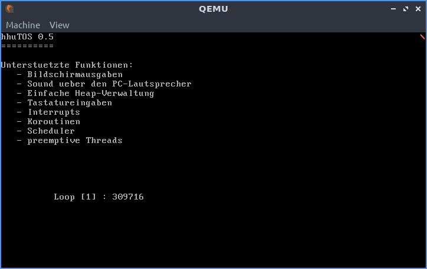

# Aufgabe 5: Preemptives Multithreading

## Lernziele
1. Tieferes Verständnis von präemptiven Multitasking
2. CPU-Entzug mithilfe des PIT
3. Synchronisierung des Schedulers und des Allokators gegenüber dem PIT-Interrupt

## A5.1: Programmable Interval Timer (PIT)
Der PIT wird ab sofort verwendet, um eine Systemzeit sowie ein erzwungenes Umschalten zwischen Threads zu realisieren. Die Systemzeit wird in der Variable 
`SYS_TIME` (in `pit.rs`) gespeichert und diese soll bei jedem Interrupt für den PIT inkrementiert. Verwenden Sie hierfür im PIT den Zähler
 0 und Modus 3 und laden Sie den Zähler mit einem passenden Wert, sodass der PIT alle 10ms ein Interrupt ausgelöst. Jeder Interrupt verursacht also eine Inkrementierung und entspricht einem Tick (10ms). Somit zeigt `SYS_TIME` an, wie viele Ticks seit dem Beginn der Zeiterfassung vergangen sind. 

Im Interrupt-Handler des PITs soll die Systemzeit in Form eines rotierenden Zeichens (engl. spinner) an einer festen Stelle dargestellt werden. Verwenden Sie hierfür beispielsweise die rechte obere Ecke und folgende Zeichen: `| / - \`, wobei das Zeichen bei jeder Ausgabe gewechselt werden soll. Das Zeichen soll jedoch nicht bei jedem Tick ausgegeben werden, sondern nur alle 100 Ticks. Da ein Tick 10ms entspricht, ändert sich das Zeichen ein Mal jede Sekunde. 

Der PIT muss in `startup` initialisiert werden. 

In folgenden Dateien muss Code implementiert werden: `devices/pit.rs` und `startup.rs`.

## A5.2: Umbau des Treibers für den PC-Lautsprecher
Die `delay` Funktion im Treiber für den PC-Lautsprecher hat bisher den PIT direkt programmiert und dafür den Zähler 0 verwendet. Das geht nun nicht mehr, da Zähler 0 nun anderweitig benötigt wird, siehe A5.1. Daher soll eine neue Version der Funktion `delay` geschrieben werden, welche in einer Busy-Waiting-Schleife `SYS_TIME`
abfragt, und abbricht, wenn `SYS_TIME` entsprechend der gewünschten Verzögerung fortgeschritten ist. Busy-Waiting ist nicht schön, aber durch das präemptive Multithreading akzeptabel. 

Testen Sie den Umbau mit einer der Melodien.

In folgender Datei muss Code implementiert werden: `devices/pcspk.rs`.

## A5.3 Umbau des Interrupt-Dispatchers in Rust
Der Interrupt-Dispatcher in Rust in der Datei `intdispatcher.rs` muss angepasst werden. Der Zugriff auf die globale Variable `INT_VECTORS` war bisher durch einen Mutex geschützt. Dies funktioniert nun nicht mehr, da wir aus der ISR des PITs einen Thread-Wechsel durchführen möchten. Dabei kehren wir vorerst nicht aus der ISR zurück, weswegen der Mutex auf `INT_VECTORS` nicht freigegeben würde. Das wiederum führt dazu, dass beim nächsten Interrupt eine Verklemmung eintritt. Man könnte in der ISR des PITs mit dem Aufruf `INT_VECTORS.force_unlock()` den Mutex jedes mal freigeben, was aber unsafe ist und zudem dazu führt, dass bei jedem Tick, also alle 10ms der Mutex mit Gewalt freigegeben wird.

Wir wählen daher eine etwas bessere Lösung, die aber leider auch unsafe ist. Wir bauen `INT_VECTORS` um auf `static mut`, wodurch ein Zugriff ohne Mutex möglich ist. Dies erfordert eine explizite Initialisierung zur Laufzeit, wofür in der Vorgabe nun eine `init` Funktion enthalten ist. Diese muss in `startup` aufgerufen werden, bevor die Interrupts erlaubt werden.

In Ihrer Funktion `register` müssen kurz die Interrupts gesperrt werden, wenn eine neue ISR registriert wird. Verwenden Sie hierfür die Funktionen `cpu::disable_int_nested()` und `cpu::enable_int_nested(param)`, nicht, dass die Interrupts unabsichtlich erlaubt werden, wenn die Funktion `register` aufgerufen wird. 

Ansonsten gibt es nur Lesezugriffe auf `INT_VECTORS` und nur von der Funktion `int_disp` dem Interrupt-Dispatcher. Diese Funktion kann aber nur ausgeführt werden, wenn die Interrupts erlaubt sind, daher die Modifikation in `register`.

In folgender Datei muss Code implementiert werden: `kernel/interrupts/intdispatcher.rs`.

## A5.4 Threadumschaltung mithilfe des PIT
Nun soll die erzwungene Thread-Umschaltung aus der ISR des PITs realisiert werden. In der Vorgabe in `scheduler.rs` ist neu die Variable `initialized`, welche anzeigt, dass der Scheduler fertig initialisiert ist. Die Variable wird im Idle-Thread gesetzt, siehe `idle_thread.rs` und in `prepare_preempt` abgefragt. Die Funktion `prepare_preempt` wird aus der ISR des PITs aufgerufen und dies kann passieren, nachdem die Interrupts in `startup` zugelassen werden und bevor der Scheduler fertig initialisiert ist. Daher gibt es nun die Variable `initialized`, um dies zu erkennen und eine Umschaltung erst nach der Intialisierung des Schedulers zuzulassen.

Die Funktion `prepare_preempt` in `scheduler.rs` soll bei jedem Tick aus der ISR vom PIT aufgerufen werden und eine erzwungene Threadumschaltung vorbereiten. Die eigentliche Umschaltung mit `thread::Thread::switch` erfolgt in `trigger` des PITs. Dies ist notwendig, da der Aufruf von `prepare_preempt` erfordert, dass wir die Sperre auf `SCHEDULER` anfordern. Würde Thread-Wechsel durchgeführt, während die Sperre gehalten wird, so würde die Sperre nicht mehr freigegeben; da ein Zurückschalten später nicht mehr möglich wäre.
 
Daher bereitet die Funktion `prepare_preempt` das Umschalten "nur" vor. Der aktuell laufende Thread wird in die `ready_queue` eingefügt. Anschliessend wird der nächste Thread, auf den umgeschaltet werden soll, aus der `ready_queue` entnommen und in `active` erfasst. Es muss natürlich geprüft werden, ob ein weiterer Thread in der `ready_queue` ist und ggf. abgebrochen werden. Wenn alles funktioniert hat, wird an die ISR ein Tupel zurückgegeben: `(current,next)`. 

In der ISR des PIT, `trigger`, muss nun `prepare_preempt` aufgerufen werden, wofür `SCHEDULER` "gelockt" werden muss. Hierfür soll `try_lock` verwendet werden, und falls die Sperre nicht erhalten wird, soll nicht umgeschaltet werden. Dies kann nur passieren, wenn ein Thread unterbrochen wurde, während er eine Schedulerfunktion aufgerufen hat und die Sperre hält. Dies wird nur selten der Fall sein. Wenn die Sperre erfolgreich zugeteilt wurde und `prepare_preempt` auch erfolgreich war, dann kann mit `thread::Thread::switch` die Thread-Umschaltung erfolgen. 

*Achtung: Es muss darauf geachtet werden, dass die Sperre vorher wieder freigegeben wird!*

Zuletzt muss in `kernel/threads/thread.asm` in der Assembler-Funktion `_thread_switch` am Ende vor der `ret`-Instruktion ein `sti` eingefuegt werden, damit die Interrupts wieder zugelassen werden. Hintergrund ist, dass wir diese Funktion nun aus der ISR des PITs aufrufen und zu diesem Zeitpunkt sind die Interrupts abgeschaltet.

In folgenden Dateien muss Code implementiert werden: `kernel/threads/scheduler.rs`, `kernel/threads/thread.asm`, `kernel/threads/idle_thread.rs` und `devices/pit.rs`.

## A5.5: Testanwendung mit Multithreading
Testen Sie das präemptive Multitasking indem Sie eine kleine Demo-Anwendung schreiben in der ein Zähler-Thread läuft, welcher einen Zähler inkrementiert und an einer festen Position auf dem Bildschirm ausgibt. Hierfür können Sie auch den Code vom Aufgabe 4 nehmen, jedoch sollte kein `yield_cpu()` verwendet werden. Jetzt wollen wir ja den Entzug der CPU überprüfen. 

Zusätzlich soll noch ein zweiter Thread erzeugt werden der eine Melodie abspielt. Neben diesen beiden Threads soll zusätzlich der Fortschritt der Systemzeit im Interrupt ausgegeben werden, siehe nachstehende Abbildung (rechts oben).

**Beispielausgab des Testprogramms**

