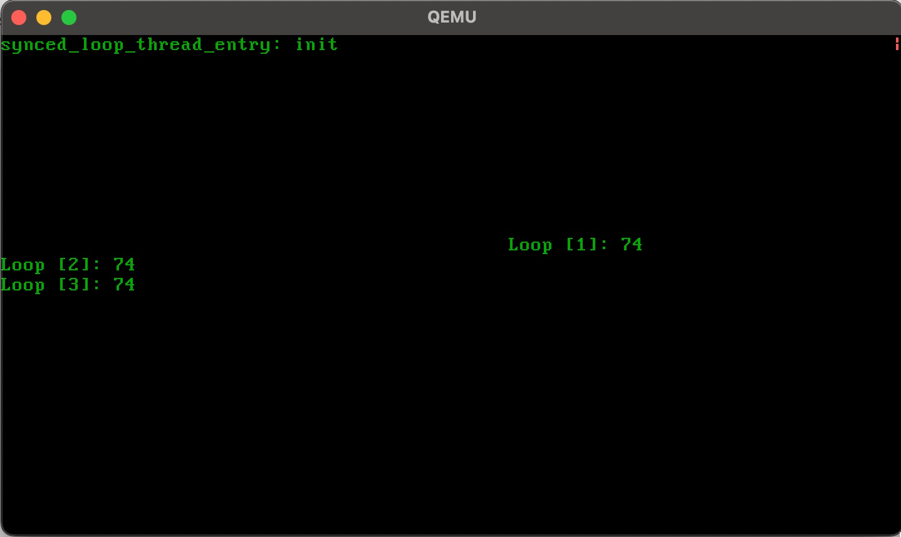
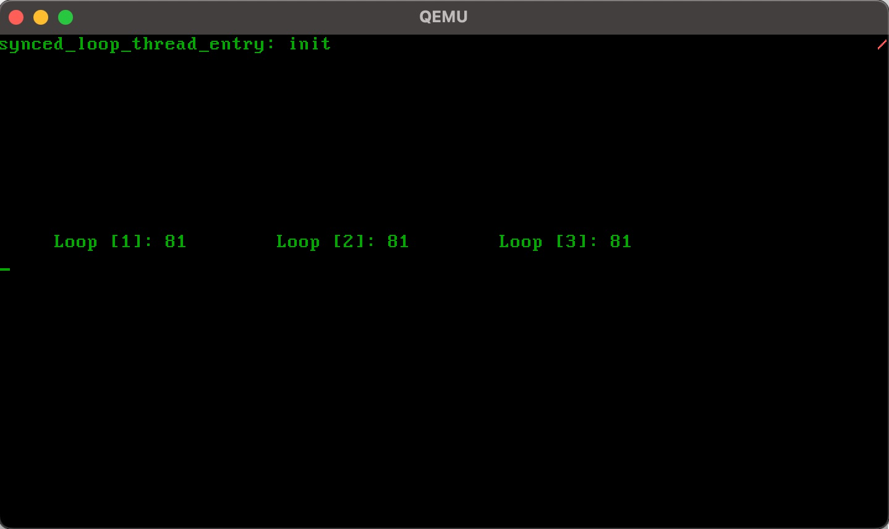

# Aufgabe 6: Synchronisierung

## Lernziele
1. Verstehen wie ein Spinlock sowie ein Guard funktioniert
2. Im Scheduler die Funktionen `block` und `deblock` realisieren  
3. Einen eigenen Mutex mit Warteschlange schreiben 

## A6.1: Synchronisierung mit Interrupt-Sperre
Gegeben ist ein fast fertiges Testprogramm, welches drei Zähl-Threads hat, welche jeweils einen Zähler an einer festen Position auf dem Bildschirm ausgeben. Erweitern Sie das Programm um einen vierten Thread, welcher eine Melodie über den Lautsprecher abspielt (siehe Aufgabe 5).

Sie sollten dann beobachten können, dass die Ausgabe des Zählerstands nicht immer an der richtigen Stelle auf dem Bildschirm erfolgt. Die richtige Ausgabe und das "Durcheinander" sehen Sie unten in den beiden Bildschirmfotos.

Überlegen Sie warum dies so ist und synchronisieren Sie die Text-Ausgaben in den Threads durch einen kritischen Abschnitt, den Sie mithilfe von Interrupt-Sperren realisieren. 

In der folgenden Datei muss Code implementiert werden: `user/aufgabe6/semaphore_demo.rs`.

## A6.2: Synchronisierung mit einem Spinlock
In der Vorgabe finden Sie eine Implementierung für einen Spinlock in `mylib/spinlock.rs`. Synchronisieren Sie damit die Zähler-Threads aus A6.1, statt die Interrupts zu sperren. Hierfür soll ein Spinlock als globale Variable (`static`), in der Test-Anwendung definiert und verwendet werden.

In der folgenden Datei muss Code implementiert werden: `user/aufgabe6/semaphore_demo.rs`.

## A6.3: Mutex mit Warteschlange
Nun soll ein Mutex mit einer Warteschlange implementiert werden. Falls ein Thread `lock` aufruft und die Sperre nicht frei ist, soll der Thread blockiert werden. In diesem Fall soll der blockierte Thread in die Warteschlange des Mutex eingefügt und auf einen anderen Thread umgeschaltet werden. 

Wenn ein Thread die Sperre freigibt, also durch das Freigeben des Guards `unlock` aufgerufen wird, so soll geprüft werden, ob die Warteschlange nicht leer ist. Falls ein Thread dort vorhanden ist, so soll dieser entfernt und in die Ready-Queue des Schedulers eingefügt werden. Dass heisst, dass nicht direkt auf den Thread umgeschaltet wird, der deblockiert wird.

In `scheduler.rs` muss die Funktion `prepare_block` implementiert werden, welche von `lock` aufgerufen werden soll, falls der Mutex gesperrt ist. Hierbei wird der Zustand im Scheduler geändert, ähnlich wie bei `prepare_preempt` (siehe Aufgabe 5). Es wird geprüft, ob ein Threadwechsel möglich ist. Falls ja wird der nächste Thread aus der `ready_qeue` entfernt und damit `active` im Scheduler gesetzt. Der blockierte Thread wird *nicht* in die `ready_qeue` eingefügt, sondern zurückgegeben, zusammen mit dem nächsten Thread. Dies ist notwendig, damit die Thread-Umscahltung in `mutex.rs` mithilfe von `Thread::switch` erfolgen kann.

Das Deblockieren ist einfacher. Hierfür muss `unlock` implementiert und unter anderem die fertige  Funktion `deblock`im Scheduler aufgerufen werden. 

Abschliessend soll die Mutex-Implementierung wieder zum Synchronisieren der gegebenen Testanwendung verwendet werden. Hierfür soll ein Mutex als globale Variable (`static`), in der Test-Anwendung definiert und verwendet werden.

In den folgenden Dateien muss Code implementiert werden: `mylib/mutex.rs`, `kernel/threads/scheduler.rs` und `user/aufgabe6/semaphore_demo.rs`. 

## A6.4: Vergleich aller Lösungen
Überlegen Sie sich Vor- und Nachteile aller drei Lösungen (A6.1 - A6.3).

## Bildschirmfotos

**Unsynchronisierte Beispielausgab des Testprogramms**

**Synchronisierte Beispielausgab des Testprogramms**

