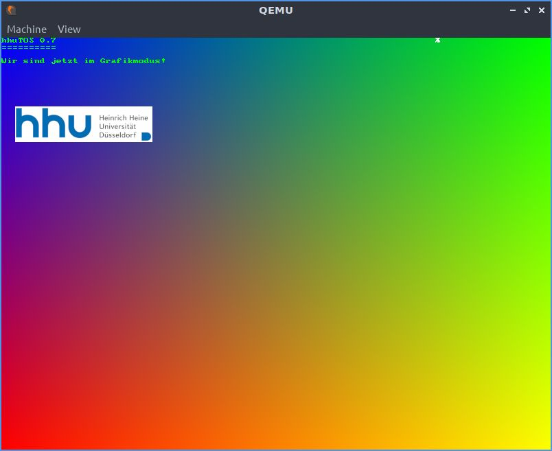

# Aufgabe 7: Eine eigene BS-Erweiterung / Anwendung

## Lernziele
1. Eine Anwendung schreiben
2. Alternativ eine Betriebssystem-Komponente entwickeln

## Mögliche Themenrichtunge
- Grafikdemo (multithreaded)
- Retro-Spiel (z.B. Snake, Pacman, ...)
- einfache Shell (Beispiele für Befehle: clear, time, meminfo, ...) 
- Scheduler mit Prioriäten (mit einer Demo)

## Vorgabe
Die Dateien in der Vorgabe umfassen einige Dateien, um einen Grafikmodus nutzen zu können. Die Vorgabe ist nur notwendig, sofern Sie im Grafikmodus arbeiten möchten.

### Grafikfunktionen 
Vorhanden sind nur sehr grundlegende Grafik-Funktionen, inkl. einer Text-Ausgabe mit einer Schriftart. Weitere Funktionen sollen je nach Anwendung ergänzt werden. 

Ob das System im Grafik- oder Textmodus startet wird in `boot/boot.asm`durch die die Konstante `TEXT_MODE` festgelegt. Wenn diese Konstante aukommentiert wird, so schaltet `grub` direkt in den Grafikmodus (800x600 mit 32 Bit pro Pixel). Eine alternative Grafikauflösung kann durch die Konstanten `MULTIBOOT_GRAPHICS_*` in  `boot/boot.asm` eingestellt werden. Mögliche Auflösungen sollten sich an dem VESA-Standard orientieren, siehe hier: [VESA](https://en.wikipedia.org/wiki/VESA_BIOS_Extensions). Es sollte immer ein Modus mit 3 oder 4 Byte pro Pixel als Farbtiefe verwendet werden.

Weitere Infos zu Multiboot findet man [hier](https://www.gnu.org/software/grub/manual/multiboot/multiboot.html).

Die Textausgabe über CGA funktioniert nicht im Grafikmodus! Ein Beispiel für die Textausgabe befindet sich in der Vorgabe in `user/aufgabe7/graphic_demo.rs`, siehe auch nachstehendes Bild. 

Folgende Dateien sind für die Grafik-Unterstützung in der Vorgabe:
- `devices/vga.rs`: Zeichenfunktionen
- `devices/fonts/font_8x8.rs`: Bitmap-Font für die Textausgabe im Grafikmodus
- `startup.rs`: Auslesen der Framebuffer-Infos, fuer `vga.rs`
- `user/aufgabe7/graphic_demo.rs`: Kleine Grafikdemo, siehe auch Bild unten
- `user/aufgabe7/bmp_hhu.rs`: HHU-Logo als Bitmap
- `cbmp2rs`: kleines C-Programm zum Konvertieren von Bildern, gespeichert von GIMP als C-Source, siehe auch `Hinweise-VGA.pdf`.

*Hinweis: Wenn Sie Ihr Projekt als Production-Version compilieren ist die Geschwindigkeit deutlich besser, was sich insbesondere bei den Grafikausgaben deutlich bemerkbar macht. Dies funktioniert wie folgt:*
`cargo make --profile production qemu`

**Beispielausgabe der Grafikdemo**

